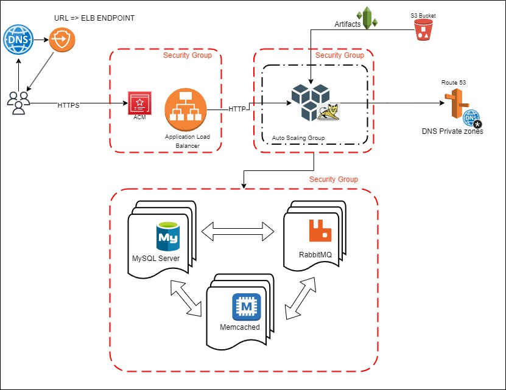

# vprofile-aws
## Objective: 
Host and run a web application (VPROFILE) on AWS
Using Lift & Shift Strategy 
Moving a physical/virtual stack to the cloud
automation IaC
use autoscatling
managing cost - pay as you go

## Desired Learning outcomes
familierizing with AWS services
autoscaling

## AWS Services
| Service | USE | 
| ------------- | ------------- | 
| EC2 Instances  | Replacing VNs for tomcat, RabbitMQ, Memcached, MySQL |
| ELB (Elastic Load Balancer)  | Replacing Nginx Load Balancer |
| autoscaling | automation fo VM scaling | 
| S3 + EFS | Shared Storage | 
| Route 53 | Private DNS Service  | 
| IAM | Identity & Access Manager  |
| ACM | Amazon Certificate Manager |
| EBS | Elastic Block Storage |

## Flow of Execution
1. Create 3 Security Groups for:  LoadBalancer, App and Backend Services
2. Create Key Pairs for EC2 Instances
3. Launch Instances with user data (Bash Scripsts)
4. Update IP to name mapping in Route 53
5. Build Application from source code (locally)
6. Upload artifact to S3 Bucket
7. Download artifcat from bucket to Tomcat EC2 instance
8. Setup ELB with https connection (using ACM)
9. Map ELB Endpoint to our website in godaddy DNS
10. Verify
11. Build Autoscaling Group for tomcat Instances

## Prerequisites:
- AWS Account
- jdk 11 and Maven 
## Create Security Groups
1. ELB Security group
    Name: vprofile-elb-SG
    Description: Security group for vprofile prod Load Balancer
    Inbound rules:
    1. HTTP (Port 80) from anywhere (temp rule)
    2. HTTPS (Port 443) from anywhere
2. App Security group
    Name: vprofile-app-SG
    Description: Security group for tomcat instances 
    Inbound rules:
    1. Custom (Port 8080) from **profile-elb-SG**
            Description: Allow traffic from vprofile prod ELB
    2. SSH (Port 22) from **MY IP**
            Description: Allow SSH
    3. Custom (Port 8080) from **MY IP**
            Description: Allow access from browser (troubleshooting)
3. Backend Security group
    Name: vprofile-backend-SG
    Description: Security group for backend services 
    Inbound rules:
    1. MYSQL (Port 3306) from **vprofile-app-SG**
        Description: Allow 3306 from application servers
    2. Custom TCP (Port 11211) from **vprofile-app-SG**
        Description: Allow tomcat to connect to memcache
    3. Custom TCP (Port 5672) from **vprofile-app-SG**
        Description: Allow tomcat to connect to RabbitMQ
    4. All Traffic from **vprofile-backend-SG**
        Description: Allow internal traffic to flow on all ports
    5. SSH (Port 22) from **MY IP**
        Description: Allow SSH

## Create Key Pairs for EC2 Instances
1. vprofile-prod-key
    Key pair type: RSA
    Private key file format: .pem

## Launch Instances with user data
1. Database Instance
    Name: *vprofile-db01*
    Project: *vprofile*
    AMI: CentOS Stream 9 (x86_64)
    type: t2.micro
    Key pair: vprofile-prod-key
    Network settings: Security group: **vprofile-backend-SG**
    Advanced details: User data : Paste contents of mysql.sh
2. Memcache Instance
    Name: *vprofile-mc01*
    Project: *vprofile*
    AMI: CentOS Stream 9 (x86_64)
    type: t2.micro
    Key pair: vprofile-prod-key
    Network settings: Security group: **vprofile-backend-SG**
    Advanced details: User data : Paste contents of memcache.sh
3. RabbitMQ Instance
    Name: *vprofile-rmq01*
    Project: *vprofile*
    AMI: CentOS Stream 9 (x86_64)
    type: t2.micro
    Key pair: vprofile-prod-key
    Network settings: Security group: **vprofile-backend-SG**
    Advanced details: User data : Paste contents of rabbitmq.sh
4. RabbitMQ Instance
    Name: *vprofile-app01*
    Project: *vprofile*
    AMI: Ubuntu Server 22.04 LTS
    type: t2.micro
    Key pair: vprofile-prod-key
    Network settings: Security group: **vprofile-app-SG**
    Advanced details: User data : Paste contents of tomcat_ubuntu.sh

## Update IP to name mapping in Route 53
Route 53 > Hosted zones > Create hosted zone
    Domain name: vprofile.in
    Type: [x] Private hosted zone (within an Amazon VPC)
    Region : us-east-1
    VPC: Default vpc

vprofile.in > Create record
    [x] Simple routing
Define simple record:
1.  Record name: db01
    Value/Route traffic to **private ip of db01**
2. Record name: mc01
    Value/Route traffic to **private ip of mc01**
3. Record name: rmq01
    Value/Route traffic to **private ip of rmq01**

## Build Application from source code (locally)
## Upload artifact to S3 Bucket
## Download artifcat from bucket to Tomcat EC2 instance
## Setup ELB with https connection (using ACM)
## Map ELB Endpoint to our website in godaddy DNS
## Verify
## Build Autoscaling Group for tomcat Instances

